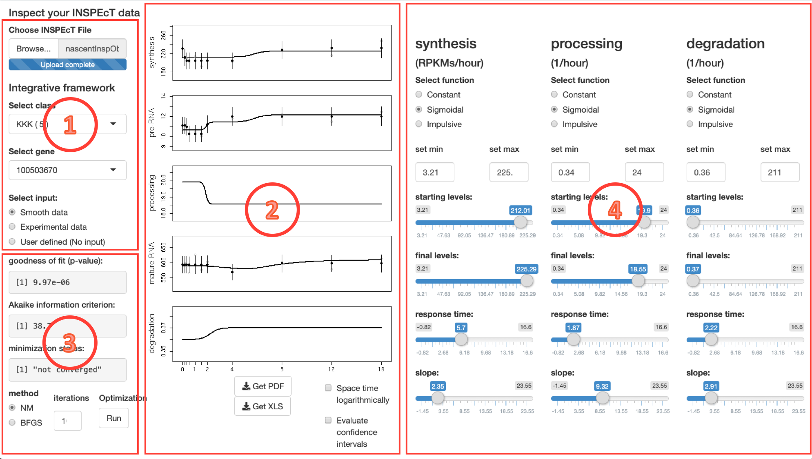
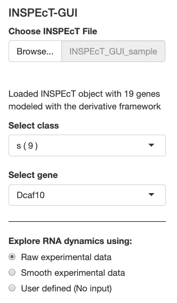
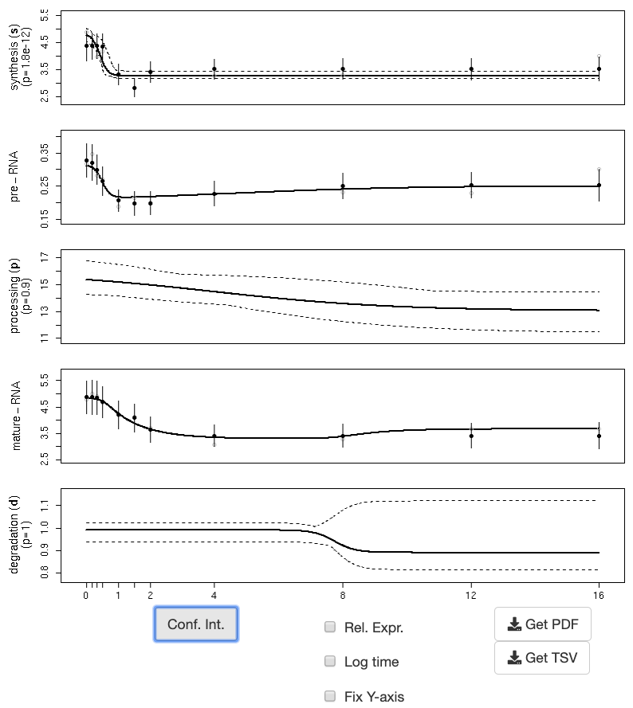
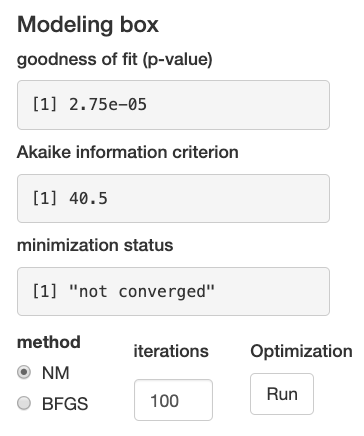
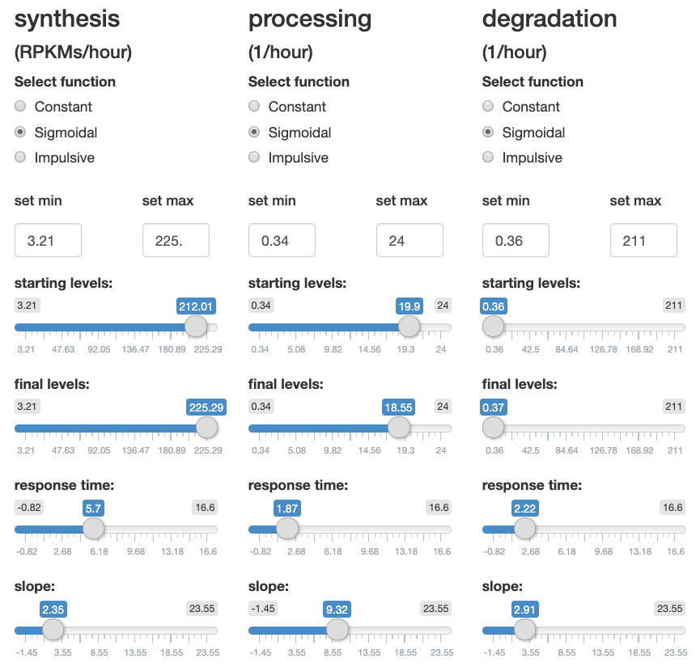
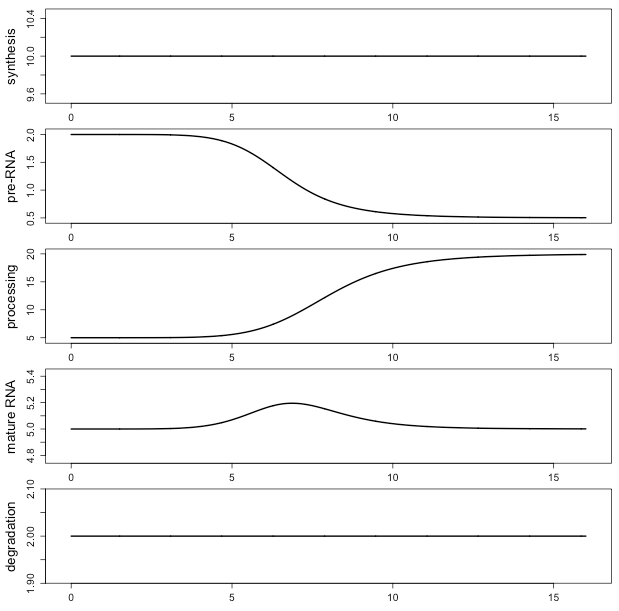
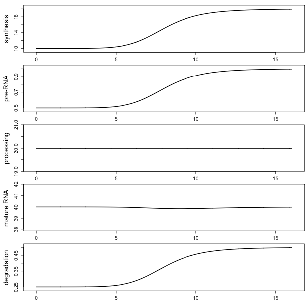

# Introduction

The life cycle of RNAs is composed of three main steps, i.e. transcription and processing of the premature RNA ($P$) and degradation of the mature ($M$). The kinetic rates governing these steps define the dynamics of each transcript ($k_{1-3}$ for synthesis, processing and degradation, respectively), and their role in transcriptional regulation is often underestimated. A complete understanding of the effects of the rates of the RNA life-cycle on premature and mature RNA requires mathematical and/or computer skills to solve the corresponding system of differential equations:

\begin{equation}\label{eq:modelsystem}
  \left\{
    \begin{array}{l l}
  \dot{P}=k_1 - k_2 \, \cdot \, P \\
  \dot{M}=k_2 \, \cdot \, P - k_3 \, \cdot \, M
    \end{array}
  \right.
\end{equation}

This system of differential equations is used by *INSPEcT* to estimate the rates of the RNA-life cycle when transctiptomic data and (possibly) newly-synthesized RNA are available. *INSPEcT* aims at assessing the dynamics of each gene by modeling the temporal behavior of the RNA kinetic rates with either constant or variable functions.

In order to visualize and interact with output of the modelig procedure of *INSPEcT*, and to facilitate the understanding of the impact of RNA kinetic rates on the dynamics of premature and mature RNA, we developed a Graphical User Interface (GUI). Specifically, the GUI allows to:

1. interact with the results of *INSPEcT* analysis on single genes, refining a model, or testing modes of regulation that are alternative to the one identified by *INSPEcT*  
2. explore how a given combination of rates results in the dynamical behavior of premature and mature RNA species.

Importantly, we developed two wrapper functions (*inspectFromBAM* and *inspectFromPCR*, see `r BiocStyle::Biocpkg("INSPEcT", vignette = "INSPEcT")` vignette for more details), which streamline the generation of novel *INSPEcT* datasets, to be uploaded in the GUI.
    
# Run the application from an R session

The GUI is distributed within the *INSPEcT* package, and starts with the following command line operations:

```{r INSPEcT_loading,eval=FALSE,echo=TRUE,message=FALSE,warnings=FALSE}
library(INSPEcT)
runINSPEcTGUI()
```

# Presentation of the Graphical User Interface

The GUI is divided into 4 sections (Fig. \@ref(fig:fig1)): 

* Section 1: interaction with an object of class *INSPEcT*;
* Section 2: visualization of the RNA dynamics for a single gene;
* Section 3: model minimization;
* Section 4: interaction with individual parameters of RNA rates.

```{r fig1,eval=TRUE,echo=FALSE, out.width="100%", fig.cap="Representation of the GUI divided into its 4 main sections.", fig.align="right"}

```

## Interaction with an object of class *INSPEcT*

At startup, the software loads a predefined *INSPEcT* object, which contains 10 genes and can be used to explore the software functionalities. This object can be replaced by any *INSPEcT* dataset previously saved in the "rds" format ("Choose *INSPEcT* file", Fig. \@ref(fig:fig2)). Genes that are part of the *INSPEcT* object are divided according to their regulation class. This is encoded by a string where letters representing the step(s) of the RNA life-cycle that are regulated ('s' for synthesis, 'p' for processing and 'd' for degradation) are concatenated. For example: "p" represents a gene only regulated in its processing rate, "sd" a gene regulated in its synthesis and degradation rates. When no rates are identified as regulated the corresponding class is named "no-reg". Once a regulation class is selected via "Select class", a specific gene can be chosen from the list that appears in "Select gene" (Fig. \@ref(fig:fig2)). Experimental profiles might be smoothed to reduce the noise associated with this kind of data ("Smooth experimental data" in "Select input", Fig. \@ref(fig:fig2)). Nonetheless, raw experimental data are selected by default ("Raw experimental data" in "Select input", Fig. \@ref(fig:fig2)). The "User defined" mode in "Select input" will be covered in section \@ref(denovo).

```{r fig2,eval=TRUE,echo=FALSE, out.width="75%", fig.cap="Interaction with an object of class INSPEcT (section 1)."}

```

## Visualization of the RNA dynamics for a single gene

For the selected gene, the experimental quantifications of the premature and mature RNA levels (estimated from RNA-seq data) are plotted together with their standard deviations (Fig. \@ref(fig:fig3)). If nascent RNA has been profiled, the rate of synthesis is also considered part of the experimental data (since it directly dereives from nascent RNA profiling), and it is plotted with its standard deviation. Otherwise, the rate of synthesis is inferred from total RNA-seq data and lacks the standard deviation. The results of the *INSPEcT* modeling are plotted with continuous lines within the synthesis, pre-RNA, processing, mature RNA and degradation panels (Fig. \@ref(fig:fig3)), and can be downloaded in PDF (image) or TSV (tabular) formats. Below the plot panel, the visualization options allow to:

* switching on/off the logarithmic time-spacing ("Log time"),
* stopping the automatic adjustment of y-axis limits, thus freezing them ("Fix Y-axis"),
* switching from absolute rates and concentrations, to measures that are relative to their initial values ("Rel.Expr.").

```{r fig3,eval=TRUE,echo=FALSE, out.width="90%", fig.cap="Visualization of the RNA dynamics for a single gene (section 2).", fig.align="center"}

```

## Model minimization{#modelmin} 

The minimization status corresponding to the modeling is reported in section 3 of the GUI (Fig. \@ref(fig:fig4)). In particular, the p-value associated to the goodness-of-fit statistic and the Akaike information criterion indicate the ability of a model to explain the experimental observations. Both these metrics are penalized for the complexity of the model, meaning that they measure a trade-off between its performance and its simplicity, and they can be used to compare models with different complexity. The complexity of a model depends on the functional forms that describe the RNA life-cycle kinetic rates: a constant rate has a complexity of 1, a sigmoidal 4, and impulsive 6, i.e. the number of their parameters. In practice, when two models explain the data adequately well, the simpler one is selected (lower p-value of the goodness-of-fit statistic and lower AIC). Additionally, the goodness-of-fit p-value is used to assess whether the model under consideration adequately explains the experimental data (e.g. p<0.05). Finally, the minimization status is reported, i.e. whether the minimization converged to a local minimum or not. Supplementary iterations can be provided to identify a better minimum, using either Nelder Mead method (NM, used from *INSPEcT*) or the quasi-Newton BFGS method (button "Optimization - Run").

```{r fig4,eval=TRUE,echo=FALSE, out.width="75%", fig.cap="Model minimization (section 3).", fig.align="center"}

```

## Interaction with individual parameters of RNA kinetic rates

Parameters of the modeling can be directly modified "by hand". In fact, for each kinetic rate of the RNA life-cycle, the parameters describing the selected functional form are provided in the right part of the GUI (Fig. \@ref(fig:fig5)). Constant rates are described by a single parameter, which correspond to the value of the rates throughout the time-course. Rather, variable rates can be described either by sigmoid or impulse functions. Sigmoids are S-shaped functions described by four parameters: starting levels, final levels, time of transition between starting and final levels, and slope of the response. Impulse functions allow more complex behaviors with two additional parameters that describe time and levels of a second transition, possibly encoding for bell-shaped responses. The range of the sliders for starting and final levels can be set for each rate ("set min" and "set max"), giving full flexibility in the setting of rates levels. At startup, these ranges are set to cover the range of all parameters of the example dataset. Each time a new dataset is loaded, ranges are updated accordingly.

```{r fig5,eval=TRUE,echo=FALSE, out.width="100%", fig.cap="Direct interaction with RNA life-cycle kinetic rates (section 4)."}

```

The user can test regulative scenarios that are alternative to the one selected by *INSPEcT*, by tuning each function parameter, or by changing the functional form assigned to one or more rates. In the latter case, the new parameter settings can be defined by hand, or searched via minimization of the error over the data (\@ref(modelmin)). Noteworthy, within the derivative framework, variable functional forms are contrained to be identical among kinetic rates. Therefore, a combination of sigmoid (or impulse) and constants is allowed, while sigmoid and impulse cannot be combined. Each time the model is modified, its plot and minimization status are updated.

## Assessing rate variability via confidence intervals estimation

The button "Conf.Int." below the plot panel (Fig. \@ref(fig:fig2)) determines 95% confidence intervals of the modeled rates. The running time of this procedure varies according to the analysis framework, the number of time points, and the complexity of the model. The analysis framework depends on the settings of *INSPEcT* at the time of generation of the loaded dataset. In general, the quantification of confidence intervals is faster in the Derivative framework, and slower in the Integrative (in the worse case, up to few minutes). Confidence intervals are then used to assess the variability of each rate, testing the null hypothesis that the rate profile can be fit by a constant model. Test p-values are reported into the y-axis labels of the corresponding rate. Every change in the model requires a fresh computation of confidence intervals, for this reason, especially in the integrative framework, it is suggested to compute confidence intervals when the model is considered definitive.

# De novo hypothesis generation - Case studies{#denovo}

The procedure explained in the previous sections mostly refers to the interaction with experimental data. Nonetheless, the software is designed also to test hypothesis independently from experiments. This can be easily achieved by choosing "User defined (No input)" in "Select input" (Fig. \@ref(fig:fig2)). In this mode, neither the row or smooth experimental data, nor the minimization status are represented. The user is thus free to set the functional form (and the corresponding parameters) for each RNA kinetic rate, directly assessing the impact on premature and mature RNA dynamics. In the following subsections, we report some case studies to exemplify the role of the RNA kinetic rates in the definition of premature and mature RNA dynamics.

## Constant RNA kinetic rates

The combination of kinetic rates determines the abundance of mature and premature RNA species. Specifically, the ratio between the rates of synthesis and processing sets premature RNA levels, and the ratio between synthesis and degradation sets the mature ones. When no perturbations occur, this long standing condition is called steady state. (Set rates to: synthesis = constant\{10\}; processing = constant\{20\}; degradation = constant\{2\})

```{r fig6,eval=TRUE,echo=FALSE, out.width="100%", fig.cap="Case study 1: constant kinetic rates.", fig.align="center"}
knitr::include_graphics("INSPEcT_GUI_figures/case_study_1.png")
```

As a consequence of this, steady state premature RNA levels are independent from degradation rates, and (more importantly and less intuitively) steady state mature RNA levels are independent from processing rates.

## Modulation of processing rate

As mentioned above, steady state mature RNA levels are independent from processing rates. Nonetheless, a perturbation in the processing dynamics leads to a transient variation of mature RNA levels. Conversely, it produces a lasting effect on premature RNA levels. (Set rates to: synthesis = constant\{10\}; processing = sigmoidal\{5,20,8,5\}; degradation = constant\{2\})

```{r fig7,eval=TRUE,echo=FALSE, out.width="100%", fig.cap="Case study 2: modulation of processing rate.", fig.align="center"}

```

Noteworthy, a reduction in the rate of degradation reduces the amplitude of mature RNA perturbation. (Set degradation = constant\{0.5\})

## Modulation of the synthesis rate

A modulation in the synthesis rate determines a similar modulation for premature and mature RNAs (in terms of fold change compared to the untreated condition). (Set rates to: synthesis = sigmoidal\{10,20,8,5\}; processing = constant\{20\}; degradation = constant\{2\})

```{r fig8,eval=TRUE,echo=FALSE, out.width="100%", fig.cap="Case study 3: modulation of synthesis rate.", fig.align="center"}
knitr::include_graphics("INSPEcT_GUI_figures/case_study_3.png")
```

Noteworthy, the time-lag between the modulation of synthesis and the response of premature RNA is inversely proportional to the processing rate (Set processing = constant\{10\}). Following the same logic, the time-lag between the reponse of premature and mature RNAs is inversely proportional to the degradation rate (Set degradation = constant\{0.5\}).

## Concomitant modulation of synthesis and degradation rates

When synthesis and degradation rates are modulated in the same direction, they apply an opposite effect on mature RNA levels, leaving trace of the transcriptional regulation only on premature RNA levels (a similar response has been observed in yeast, during heat shock responses). (Set rates to: synthesis = sigmoidal\{10,20,8,5\}; processing = constant\{20\}; degradation = sigmoidal\{0.25,0.5,8,5\}). Rather, the opposite modulation of synthesis and degradation reinforces the modulation of mature RNA. (Set degradation = sigmoidal\{0.5,0.25,8,5\})

```{r fig9,eval=TRUE,echo=FALSE, out.width="100%", fig.cap="Case study 4: concomitant modulation of synthesis and degradation rates.", fig.align="center"}

```

# Video tutorial

<iframe width="768" height="432" src="https://multimedia.iit.it/asset-bank/servlet/file?contentDispositionFilename=mut5960893213920264239.mp4&signature=48626e694a7236777a4d712f584b3275484e524933465a625675674b6a67462f65426e645a33325461767a554d4b4d47796c385a77504c495978776f4661624268376d59354c47476a4d69444e2f322b6d51676d6531684656376a537041593148625458556d4e756f794d3d&contentDisposition=inline&contentIdentifier=ca2/O5yfWQgDGNswRGid90v0SWiP7e6S.mp4&contentStoreIdentifier=4" frameborder="0" allow="accelerometer; autoplay; encrypted-media; gyroscope; picture-in-picture" allowfullscreen></iframe>

# About this document

```{r session}
sessionInfo()
```